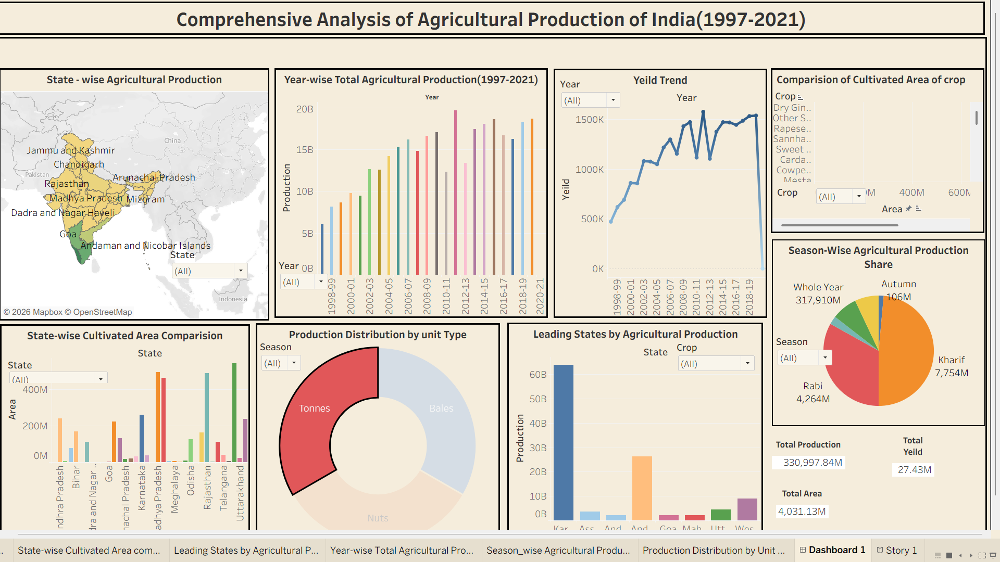

# 🌾 India's Agricultural Crop Production Analysis (1997–2021)

## 📖 Overview

India's Agricultural Crop Production Analysis is a Business Intelligence and Data Visualization project developed using **Tableau**. The project analyzes historical agricultural crop production data from **1997 to 2021** to identify production trends, seasonal variations, regional performance, and crop-wise insights.

The project transforms raw agricultural data into interactive dashboards and Tableau Stories, enabling users to explore agricultural information through intuitive visualizations and support data-driven decision-making.

---

## 🎯 Problem Statement

India generates a large volume of agricultural production data every year. Analyzing this information manually is time-consuming and makes it difficult to identify production trends, seasonal patterns, and regional performance.

This project addresses these challenges by transforming historical agricultural crop production data into interactive Tableau dashboards and stories, making agricultural information easier to analyze and understand.

---

## 👥 Project Scenarios

### 🌱 Scenario 1: Small-Scale Farmer

A farmer can use the dashboard to:

- Analyze historical crop production trends.
- Compare seasonal crop performance.
- Identify high-performing crops.
- Make informed cultivation decisions and reduce production risks.

---

### 🏛 Scenario 2: Government Policy Analyst

A government policy analyst can use the dashboard to:

- Analyze state-wise agricultural performance.
- Identify low-performing regions.
- Evaluate long-term production trends.
- Support data-driven agricultural planning.

---

### 💼 Scenario 3: Agribusiness Investor

An agribusiness investor can use the dashboard to:

- Compare crop production trends.
- Identify high-growth agricultural regions.
- Analyze historical production patterns.
- Make informed investment decisions.

---

## 📊 Dashboard Features

- Interactive Tableau Dashboard
- Tableau Story
- KPI Cards
- Crop-wise Analysis
- State-wise Analysis
- Season-wise Analysis
- Year-wise Production Trends
- Interactive Filters

---

## 🛠️ Technologies Used

- Tableau Public
- Microsoft Excel

---

## 📂 Dataset

**Dataset:** India's Agricultural Crop Production (1997–2021)

The dataset contains historical agricultural production data across different states, crops, seasons, and years.

---

## 📷 Dashboard Preview

### 📊 Dashboard



### 📖 Tableau Story


---

## 🌐 Tableau Public

**Dashboard:** *(https://public.tableau.com/shared/3MMM3HWBJ?:display_count=n&:origin=viz_share_link)*

**Story:** *(https://public.tableau.com/views/ComprehensiveAnalysisofAgriculturalProductionofIndia1997-2021/Story1?:language=en-US&:sid=&:redirect=auth&:display_count=n&:origin=viz_share_link)*

---

## 📑 Project Report

The complete project documentation is available in the **Report** folder.

---

## 👩‍💻 My Contributions

- Designed and developed the **Tableau Dashboard**.
- Created the **Tableau Story** for data storytelling.
- Published the project on **Tableau Public**.
- Prepared the complete **Project Report** with project documentation and insights.

---

## 📈 Key Insights

- Identified the highest agricultural producing states across India.
- Compared crop production across different seasons.
- Analyzed year-wise production trends from **1997–2021**.
- Evaluated crop-wise production performance.
- Identified regional agricultural growth patterns using interactive dashboards.
- Enabled stakeholders to make data-driven decisions through visual analytics.

---

## 📁 Repository Structure

```text
India-Agricultural-Crop-Production-Analysis
│
├── Dataset
├── Images
├── Report
├── Tableau
└── README.md
```

---

## 📜 License

This project is created for educational and portfolio purposes.
